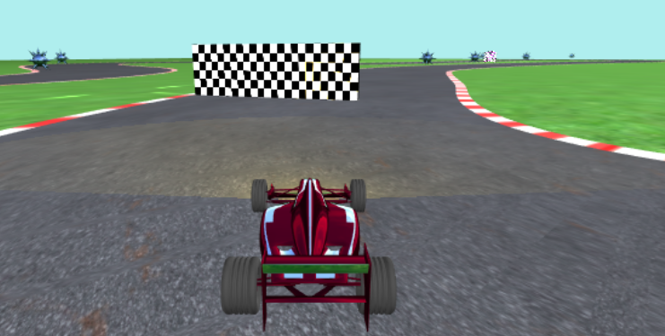
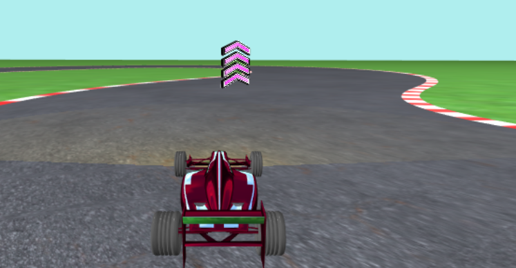

# TrickyRace

TrickyRace is a race game made entirely with javascript and WebGL. The objective is to complete a whole lap trying to avoid the obstacle and obtain the maximum score. To help you, along all the track there are some speed boost that will make your car faster for a small amount of time. <b>Enjoy!</b>

### Set Up
Clone the repository on a local folder<br>
```
git clone https://github.com/xAlessandroC/TrickyRace
```
or download the zip.

In order to play the game you need to start a web server.
With Python you can execute the following command</br>
```
python -m http.server [port]
```
inside the folder.
Open your browser and type
```
localhost:[port]/application.html
```
You should see a loading screen like this

<p align="center">
  
</p>

## Features

<div>
  <div style="float:left; width:50%">
    Finish the lap in the minor possible time.
  </div>
  <div style="float:right">
  <p align="center">
  
  </p>
  </div>
<div>
<div style="clear: left;clear: right; padding-bottom:10px;"></div>
<div>
  <div style="float:left">
    <p align="center">
    
    </p>
  </div>
  <div style="float:right; width:50%;padding:10px">
    Pay attention to the obstacles.
  </div>
<div>
<div style="clear: right;clear: left; padding-bottom:10px;"></div>
<div>
  <div style="float:left; width:50%;padding:10px">
    Pick and use boost for speed up you car.
  </div>
  <div style="float:right">
    <p align="center">
    
    </p>
  </div>
<div>
